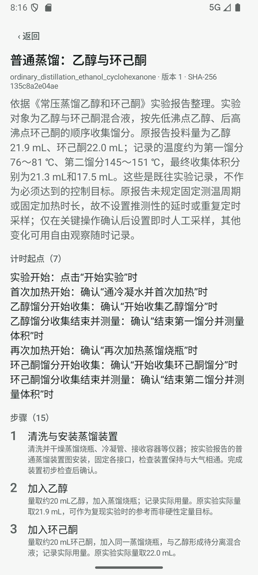
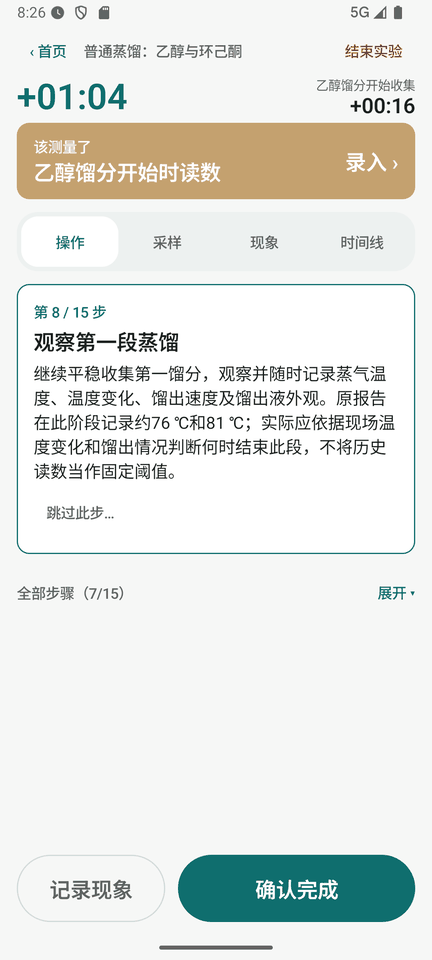
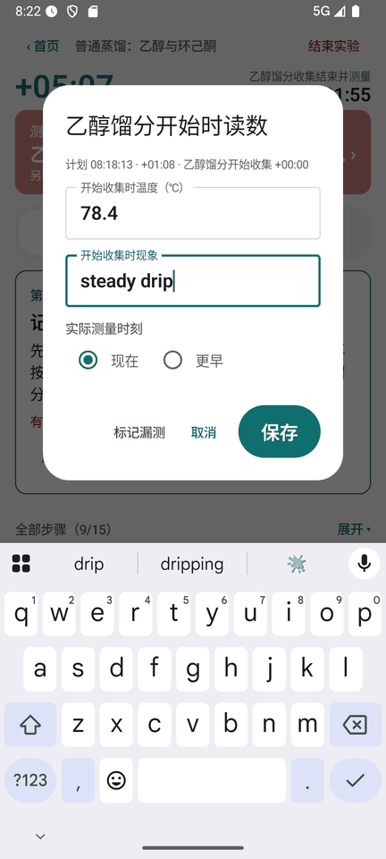
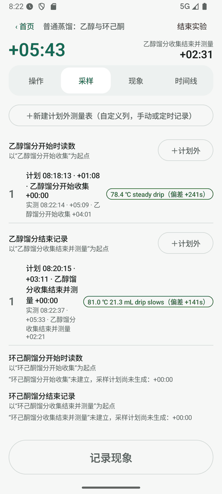
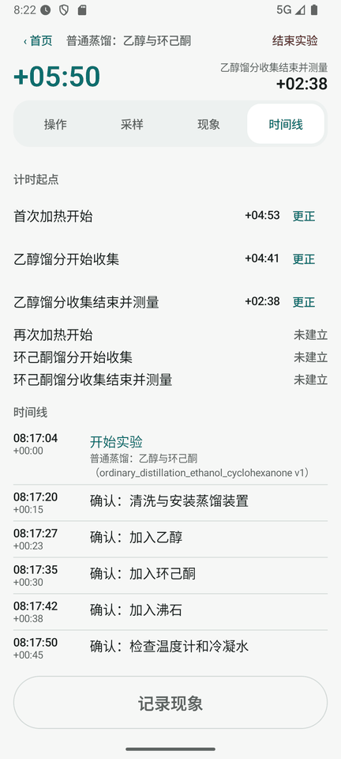
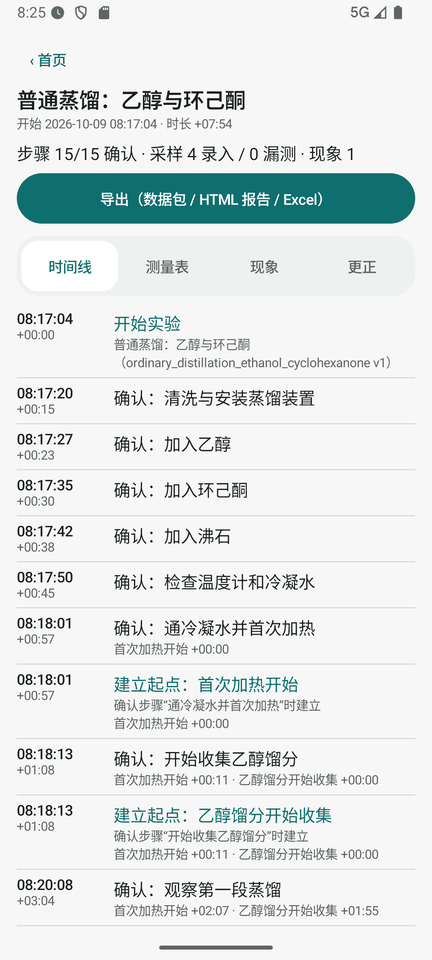
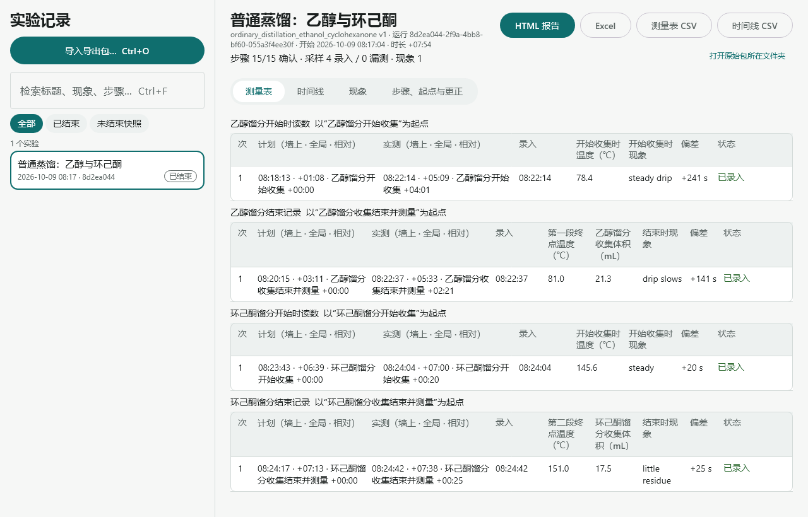
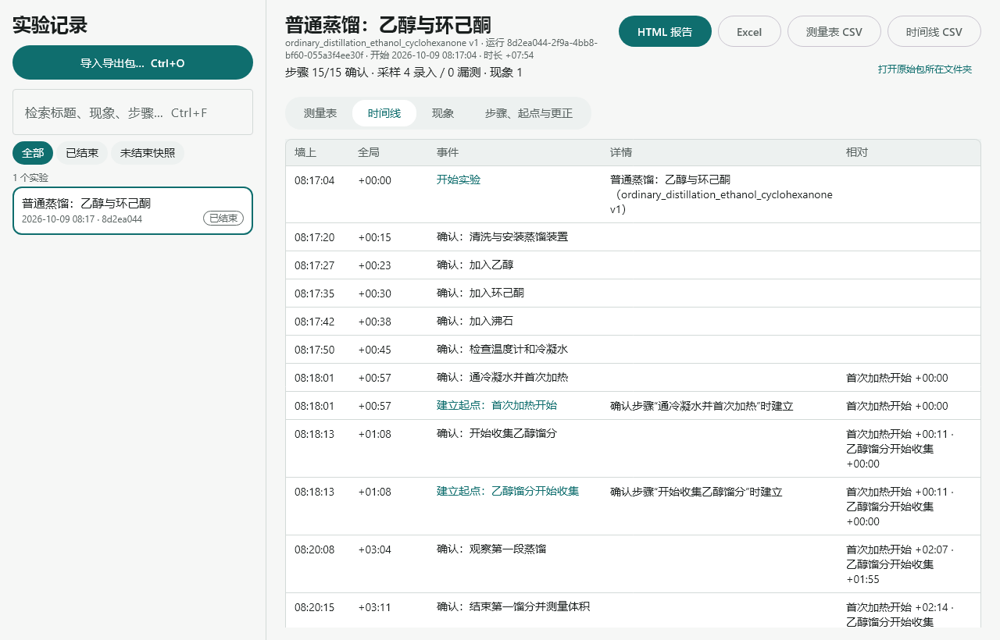
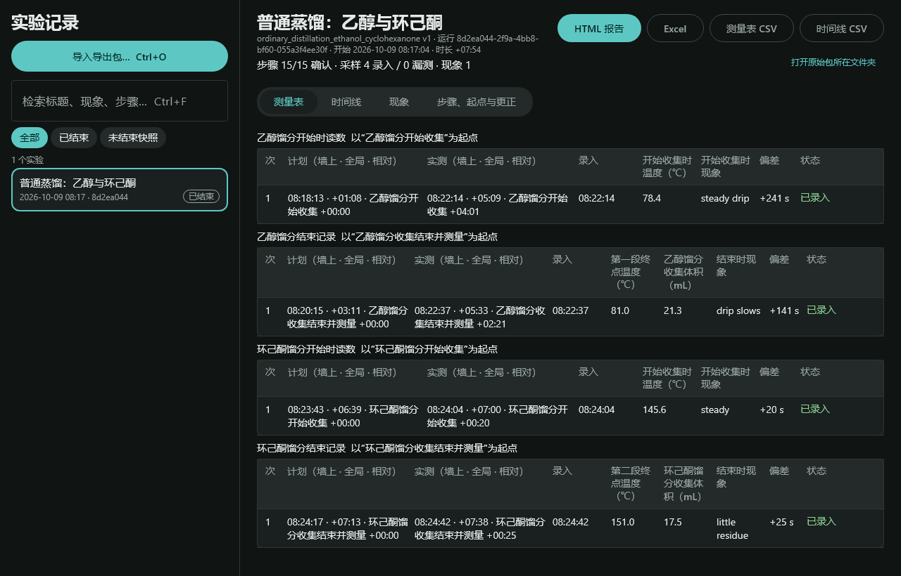
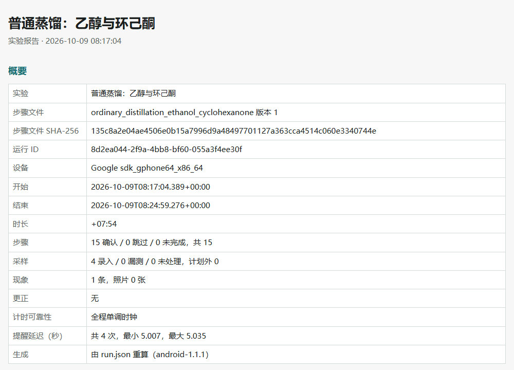

# LabRun 实验记录

**手机按步骤做实验、到点提醒测量、随手记现象；电脑查看、整理、出报告。**

LabRun 由两部分组成：原生安卓 App 用在实验现场，Windows 电脑端用来查看和整理。两边通过一个导出包（`.labrun.zip`）传递数据，**不联网、不需要账号**。

- 实验步骤写在一个 JSON「步骤文件」里，可以让 ChatGPT 根据实验讲义生成。
- 计时从不暂停。每个测量点都记三个时刻：计划时刻、实际测量时刻、录入时刻，任何时刻都可以对应到总时间线和各段的相对计时上。
- 记录只追加，不改写。录错了可以追加一条更正，原值永远保留。

> 下载：[Releases](https://github.com/YaNg7270/labrun/releases/latest)（安卓 APK、Windows 安装包 MSI、免安装 zip，附 SHA-256 校验值）

## 截图

截图中的实验是“普通蒸馏：乙醇与环己酮”，在安卓模拟器和电脑端实际运行得到。

### 手机

| 导入预览 | 到点提醒 | 录入测量 |
| :---: | :---: | :---: |
|  |  |  |
| 校验通过才能开始，列出计时起点、步骤和采样计划 | 采样到点后顶部出现闪烁色块，任何页签都看得到；底部是两个大按钮，戴手套也好按 | 默认记“现在测的”；晚录时可以补填实际测量时刻 |

| 测量表 | 计时起点与时间线 | 实验结束后 |
| :---: | :---: | :---: |
|  |  |  |
| 每次测量显示计划 / 实测时刻和偏差 | 每段计时起点都能单独更正，时间线同时标出相对各起点的时间 | 手机上可以直接导出数据包、HTML 报告或 Excel |

### 电脑



| 时间线 | 深色模式 |
| :---: | :---: |
|  |  |

### HTML 报告（可打印为 PDF）



## 功能

**手机（Android 8.0+，Jetpack Compose 原生界面）**

- **导入步骤文件**：逐项校验，出错时给出 JSON 位置和原因；文件版本冲突会被拒绝。
- **多段计时**：全局计时从“开始实验”算起。局部计时起点可以在确认某一步时自动建立，也可以临场手动建立（允许回填更早的时刻）。
- **采样计划**：相对某个起点的固定时刻（如 +1:00、+2:00）。到点用系统闹钟级提醒，锁屏、省电模式下也能响；晚录不会顺延。
- **计划外测量**：可以按已有计划的列补记一条，也可以临场新建测量表（自定义 1–10 列，手动记录或每隔 N 秒定时提醒）。
- **现象记录**：文字加拍照，可以填更早的发生时间，记录不会推进步骤。
- **更正**：测量值、测量时刻、起点时刻、现象都可以更正或作废，误点的“确认完成”和“漏测”可以撤销。全部以追加记录的方式保存，实验结束后仍可更正。
- **防误触与恢复**：新步骤出现后 1 秒内不能确认；App 被杀、手机重启后自动恢复，重启后的时间标为“估算”。
- **导出**：数据包、HTML 报告、Excel（每个采样计划一张时间表工作表）。

**电脑（Windows 10/11）**

- **导入数据包**：可以一次选多个。同一个包只保留一份；重新导出的修订会并存，不会覆盖。
- **查看**：可以检索和筛选；测量表带折线图，还能看时间线、现象照片、步骤、计时起点和更正记录。
- **导出**：HTML 报告、Excel 和 CSV。

## 快速开始

1. **安装**：从 [Releases](https://github.com/YaNg7270/labrun/releases/latest) 下载。手机装 APK；电脑装 MSI，或者解压免安装版后运行 `LabRun\LabRun.exe`。
2. **手机首次打开**：允许通知，并在系统设置里把“实验记录”的电池优化设为“不限制”，否则锁屏后提醒可能不准时。
3. **准备步骤文件**：把 [`docs/ChatGPT步骤文件提示词.md`](docs/ChatGPT步骤文件提示词.md) 里的提示词连同实验描述一起发给 ChatGPT，把它回复的 JSON 存成 `xxx.protocol.json`，传到手机上导入。可以先用 [`examples/全功能测试.protocol.json`](examples/全功能测试.protocol.json) 试一轮。
4. **做实验**：每做完一步点“确认完成”；采样到点时点顶部的色块录入；有现象随时点“记录现象”。
5. **整理**：实验结束后在详情页导出。数据包传到电脑，在电脑端用“导入导出包…”（`Ctrl+O`）打开。

完整操作说明见 [`交付/使用说明.md`](交付/使用说明.md)。

## 步骤文件示例

```json
{
  "format": "lab-protocol-draft",
  "format_version": "0.1",
  "protocol_id": "demo",
  "protocol_version": "1",
  "title": "示例实验",
  "time_unit": "seconds",
  "run_start_anchor_id": "run_start",
  "anchors": [
    { "id": "run_start", "label": "实验开始", "create_on": { "event": "run_started" } },
    { "id": "heat", "label": "开始加热", "create_on": { "event": "step_confirmed", "step_id": "s_heat" } }
  ],
  "steps": [
    { "id": "s_heat", "title": "开始加热", "completion": "manual_confirmation" },
    { "id": "s_watch", "title": "观察并测温", "completion": "manual_confirmation", "sampling_plan_ids": ["p_temp"] }
  ],
  "sampling_plans": [
    { "id": "p_temp", "label": "温度", "anchor_id": "heat", "offsets": [60, 120, 180], "capture_mode": "manual",
      "fields": [{ "id": "t", "label": "温度", "type": "decimal", "unit": "℃" }] }
  ],
  "free_observations": { "enabled": true, "step_association": "optional", "advances_step": false }
}
```

格式定义见 [`schema/lab-protocol-0.1.schema.json`](schema/lab-protocol-0.1.schema.json)，语义规则见 [`docs/01_需求契约.md`](docs/01_需求契约.md)。

## 从源码构建

需要 JDK 17、Android SDK（compileSdk 36），使用仓库自带的 Gradle Wrapper。

```bash
cd labrun
./gradlew :core:test :desktop:test      # 单元测试
./gradlew :android:assembleDebug        # 安卓调试版 APK
./gradlew :desktop:run                  # 运行电脑端
./gradlew :desktop:packageMsi           # Windows 安装包
```

更多说明（正式签名、中文路径下打包等）见 [`labrun/README.md`](labrun/README.md)。

## 项目结构

| 路径 | 内容 |
| --- | --- |
| `labrun/core` | 平台无关的 Kotlin 核心：步骤文件解析校验、事件模型、运行引擎、状态重放、时间线与测量表、导出包读写、HTML/Excel 报告 |
| `labrun/android` | 安卓 App（Jetpack Compose） |
| `labrun/desktop` | 电脑端（Compose Desktop） |
| `schema/` | 步骤文件 JSON Schema |
| `examples/` | 示例步骤文件 |
| `docs/` | 需求契约（语义、时间模型、文件格式）、设计规范、ChatGPT 提示词 |
| `交付/` | 使用说明、示例、安装包校验值（安装包本身在 Releases） |

手机执行、导出包校验、电脑展示和报告生成都调用同一个 `RunState.replay`，所以两端的状态、术语和时间格式完全一致。

## 已知限制

- 提醒准时度取决于手机系统。模拟器实测为毫秒级，国产系统在锁屏和省电模式下的表现需要在自己手机上确认。
- 一部手机同一时间只能进行一个实验。
- 手机和电脑之间不会自动同步，需要手动传导出包。
